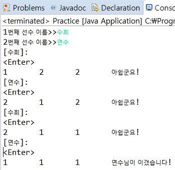

https://m.blog.naver.com/ui1184/221407970634

#### 겜블링 게임을 만들어보자. 두 사람이 게임을 진행한다. 이들의 이름을 키보드로 입력받으며 각 사람은 Person 클래스로 작성하라. 그러므로 프로그램에는 2개의 Person 객체가 생성되어야 한다. 두 사람은 번갈아 가면서 게임을 진행하는데 각 사람이 자기 차례에서 <Enter> 키를 입력하면, 3개의 난수가 발생되고 이 숫자가 모두 같으면 승자가 되고 게임이 끝난다. 난수의 범위를 너무 크게 잡으면 3개의 숫자가 일치하게 나올 가능성이 적기 때문에 숫자의 범위는 1~3까지로 한다.

